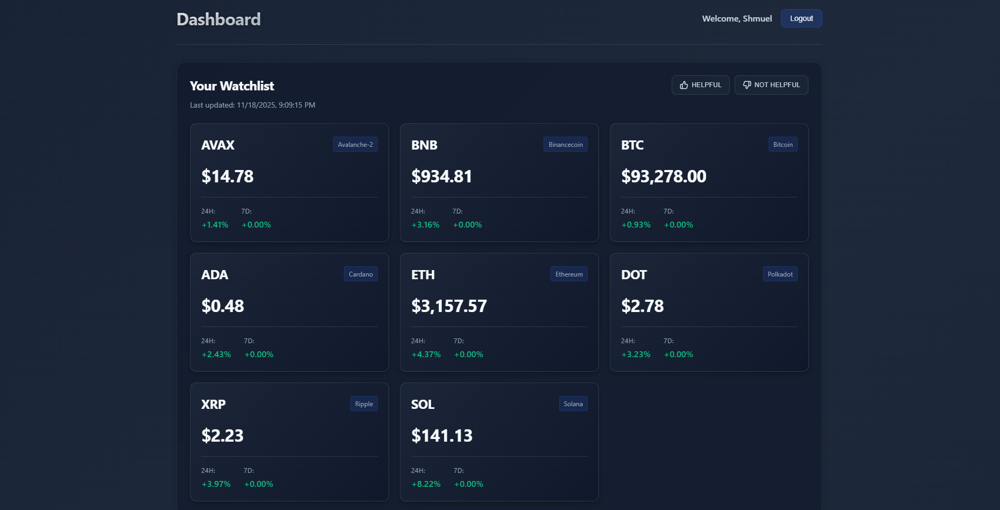
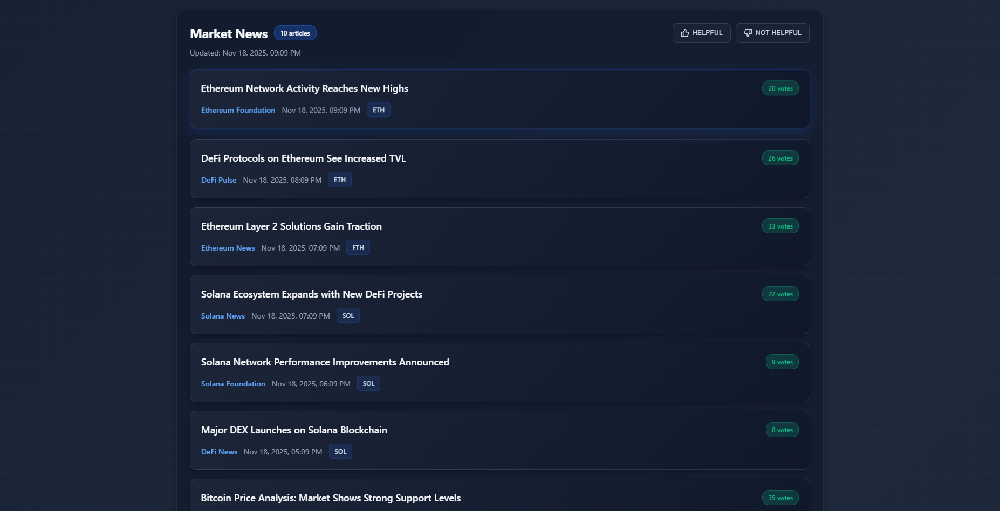
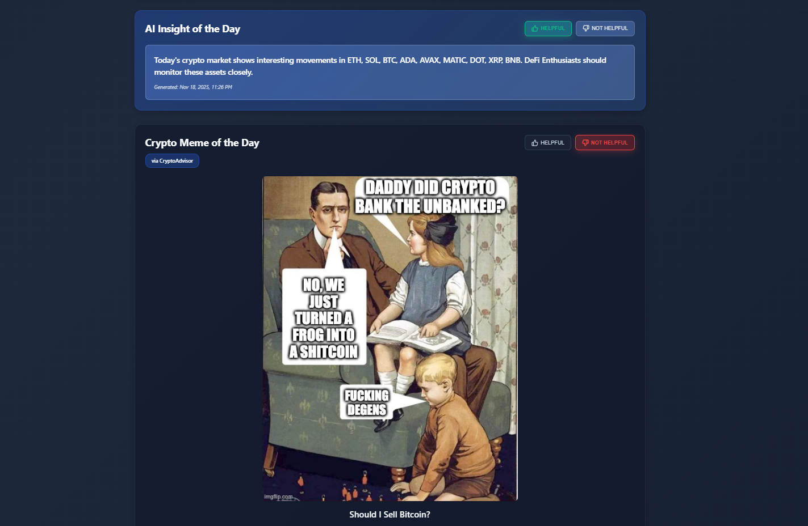

# Moveo AI Crypto Advisor – Frontend

Personalized crypto investor dashboard built with React + Vite. Features real-time coin prices, market news, AI insights, and crypto memes tailored to each user's preferences.

🌐 **Live Demo**: [https://crypto-advisor-three.vercel.app/](https://crypto-advisor-three.vercel.app/)

## Features

- **Authentication**: JWT-based login/signup with protected routes
- **Onboarding**: Multi-step questionnaire to personalize user experience
- **Dashboard**: 
  - Real-time coin prices (CoinGecko API)
  - Market news (CryptoPanic API)
  - AI-generated insights (personalized)
  - Crypto memes (random, personalized)
- **User Feedback**: Thumbs up/down voting on all dashboard sections
- **Video Backgrounds**: Dynamic video backgrounds on login and onboarding pages
- **Responsive Design**: Works seamlessly on desktop and mobile

## Screenshots

### Coin Prices Dashboard


The **Coin Prices** section displays real-time cryptocurrency prices from CoinGecko API. Each coin card shows the symbol, current price in USD, and 24-hour and 7-day percentage changes. Prices are color-coded (green for positive, red for negative changes) and personalized based on the user's selected interests from onboarding. The section includes a "Last updated" timestamp and feedback buttons for user interaction.

### Market News Section


The **Market News** section aggregates cryptocurrency news articles from CryptoPanic API. Each news card displays the article title (clickable link), source, publication date, vote count, and related currencies. News articles are filtered by the user's preferred coins and content types, ensuring personalized and relevant content. Users can click on article titles to read the full story on the source website.

### AI Insights & Memes


The dashboard includes two additional personalized sections:

- **AI Insight of the Day**: Features AI-generated insights using OpenRouter API, tailored to the user's investor type, preferred assets, and content preferences. The insight is displayed in a gradient card with glassmorphism effects, showing the generation date and model information.

- **Crypto Meme of the Day**: Displays a randomly selected crypto meme from a curated collection, personalized based on user interests. Each meme includes a title, description, source badge, and fetched date. The memes add a fun, engaging element to the dashboard experience.

Both sections include feedback buttons (thumbs up/down) to help improve future recommendations through machine learning.

## Tech Stack

- **React 18** - UI framework
- **Vite** - Build tool
- **React Router DOM** - Client-side routing
- **Redux** - State management
- **Axios** - HTTP client
- **Sass** - CSS preprocessing
- **React Context API** - Authentication state

## Getting Started

### Prerequisites

- Node.js 16+ and npm

### Installation

```bash
# Install dependencies
npm install

# Start development server
npm run dev
```

The app will be available at `http://localhost:5173`

### Environment Variables

Create `.env.local` file in the root directory:

```env
# Backend API URL
# Development: http://localhost:3030/api
# Production (Vercel): Set VITE_API_URL in Vercel dashboard to: https://cryptoadvisor-backend.onrender.com/api
VITE_API_URL=http://localhost:3030/api

# Optional: AI Service API Keys (if calling from frontend)
# VITE_OPENROUTER_API_KEY=your-key-here
# VITE_HF_API_KEY=your-key-here
```

**Note**: 
- The `.env.local` file is gitignored. Copy the values above and create your own file.
- For production on Vercel, set `VITE_API_URL` in Vercel dashboard → Settings → Environment Variables
- Value should be: `https://cryptoadvisor-backend.onrender.com/api`

## Scripts

- **npm run dev**: Start development server
- **npm run build**: Build for production
- **npm run preview**: Preview production build

## Project Structure

```
src/
├── assets/
│   └── styles/
│       └── main.scss          # Global styles
├── cmps/
│   ├── dashboard/
│   │   ├── CoinPricesSection.jsx
│   │   ├── MarketNewsSection.jsx
│   │   ├── AIInsightSection.jsx
│   │   └── MemeSection.jsx
│   ├── ProtectedRoute.jsx
│   ├── OnboardingGuard.jsx
│   └── UserMsg.jsx
├── contexts/
│   └── AuthContext.jsx        # JWT authentication
├── customHooks/
│   └── useForm.js
├── pages/
│   ├── LoginSignup.jsx
│   ├── Onboarding.jsx
│   └── Dashboard.jsx
├── services/
│   ├── dashboard.service.js
│   ├── preferences.service.js
│   ├── user/
│   ├── http.service.js
│   ├── storage.service.js
│   └── event-bus.service.js
├── store/
│   ├── store.js
│   ├── user.reducer.js
│   └── user.actions.js
└── RootCmp.jsx
```

## API Integration

### Backend Endpoints

- `POST /api/auth/login` - User login
- `POST /api/auth/signup` - User registration
- `GET /api/user/preferences` - Get user preferences
- `POST /api/user/preferences` - Save user preferences
- `GET /api/dashboard` - Get personalized dashboard data
- `POST /api/user/feedback` - Submit user feedback (thumbs up/down)

### Authentication

All protected endpoints require JWT token in `Authorization: Bearer {token}` header. Token is automatically added by `httpService`.

## User Flow

1. **Login/Signup** → User authenticates
2. **Onboarding** → User answers 3 questions about preferences
3. **Dashboard** → Personalized content based on preferences:
   - Coin prices for selected assets
   - News articles about preferred coins
   - AI insights tailored to investor type
   - Random memes matching interests

## Video Assets

Place video files in `public/videos/`:
- `login-bg.mp4` - Login page background (red/yellow trading theme)
- `onboarding-bg.mp4` - Onboarding page background

## Styling

- **Design System**: Professional, minimal, pixel-perfect
- **Colors**: Classic palette with primary blue accent
- **Typography**: System fonts for optimal performance
- **Responsive**: Mobile-first approach with breakpoints

## Deployment

### Vercel (Recommended)

1. Connect GitHub repository
2. Set environment variables in Vercel dashboard
3. Deploy automatically on push to main

### Build

```bash
npm run build
```

Output: `dist/` folder ready for static hosting

## Development Notes

- JWT tokens stored in localStorage via `storageService`
- Protected routes use `ProtectedRoute` component
- Onboarding status checked on login
- All API calls include automatic error handling
- Video backgrounds autoplay (muted, looped)

## AI Tools Usage Summary

This project was developed with assistance from AI coding tools (Cursor AI). Below is a summary of how AI was used:

### Development Process
- **Code Generation**: AI assisted with generating React components, service files, and styling
- **Architecture Decisions**: AI helped structure the project following React best practices
- **Debugging**: AI assisted in identifying and fixing bugs, especially around JWT authentication and API integration
- **Documentation**: AI helped create comprehensive README and technical documentation

### Key AI-Assisted Areas
1. **Component Structure**: React component patterns and hooks usage
2. **State Management**: Redux store setup and Context API for authentication
3. **API Integration**: HTTP service with interceptors for JWT token management
4. **Styling**: SCSS organization and responsive design patterns
5. **Error Handling**: Comprehensive error handling across all API calls

### Human Oversight
All code was reviewed, tested, and refined. AI suggestions were evaluated for:
- Code quality and maintainability
- Security best practices (especially for authentication)
- Performance considerations
- User experience

### Tools Used
- **Cursor AI**: Primary coding assistant for development
- **GitHub Copilot**: Not used
- **ChatGPT**: Not used

## Future Enhancements

- [ ] Widget customization (drag & drop dashboard)
- [ ] Real-time price updates (WebSocket)
- [ ] Advanced charting for coin prices
- [ ] User settings page

## Bonus: ML Training Proposal

### Quick Overview
See [`FEEDBACK_TRAINING_LOOP.md`](./FEEDBACK_TRAINING_LOOP.md) for a visual, executive summary of how feedback is collected, stored, and used to improve recommendations.

### Detailed Technical Proposal
See [`ML_TRAINING_PROPOSAL.md`](./ML_TRAINING_PROPOSAL.md) for a comprehensive technical proposal covering:

- Data collection and feature engineering
- Model selection (collaborative filtering, content-based, hybrid)
- Training strategy and evaluation metrics
- Recommendation engine implementation
- Continuous learning pipeline
- A/B testing framework

### How Feedback is Stored

**Feedback Data Structure**:
```json
{
  "userId": "user123",
  "sectionType": "coinPrices",  // or "marketNews", "aiInsight", "meme"
  "vote": "up",                 // or "down"
  "metadata": {},               // Optional context
  "timestamp": "2025-01-16T20:00:00.000Z"
}
```

**Training Process**:
1. Collect feedback data (4-8 weeks)
2. Engineer features from user preferences + feedback patterns
3. Train ML model to predict user preferences
4. Deploy recommendation engine
5. Continuously retrain with new feedback

This demonstrates understanding of how feedback can be used to improve future recommendations through machine learning.

## License

Private project - Moveo AI Crypto Advisor
